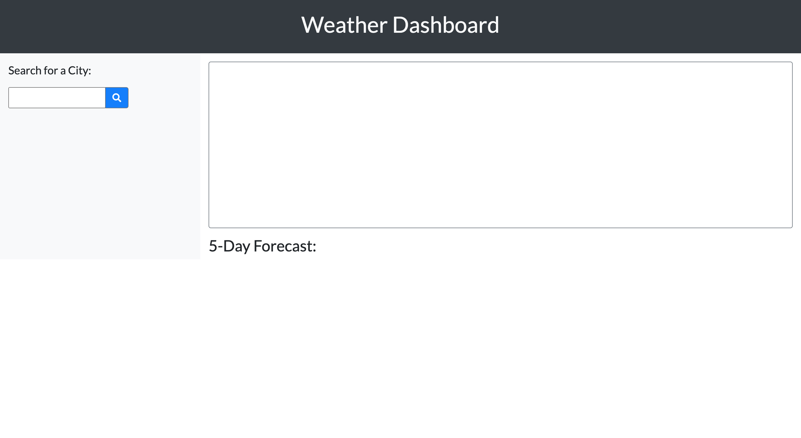

# Weather Dashboard

A weather dashboard application that utilizes a third-part API, the OpenWeather API, to display weather conditions for cities. HTML and CSS elements are dynamically updated when cities are searched. The application allows users to:

* Search cities using a search bar to recieve information on a city's weather conditions.

* The city's name, the date, an icon representing the weather, the temperature, the humidity, the wind speed, and the UV index are displayed to the user.

* If the UV index's conditions are favorable (less than 4), then it will be highlighted in green. If the conditions are moderate (4-7), then it will be highlighted in yellow. If the UV index's conditions are severe (greater than 7), then it will be highlighted in red.

* The city's 5-day forecast is also shown below, with the date, an icon, the temperature, and the humidity for each day.

* Searching a city provides the user with a search history. The search history is a list of buttons the user can click on to view previously searched weather conditions.

* Upon opening the weather dashboard, or upon refreshing the page, the search history will be displayed, along with the weather conditions for the most recently searched city.

Below are some images displaying the Weather Dashboard's functionality

* This is the initial state of the dashboard.

* After searching "Anaheim", the search history updates and displays the weather conditions and the five-day forecast for Anaheim.

* Another search with "Houston", updating the search history on the left side of the dashboard.

* A final search for "Juneau", this city has a moderate UV index, which is displayed with a yellow background. Upon refreshing the page, Juneau would be the latest entry in the search history, therefore would be displayed again on the dashboard.

View the weather dashboard at https://mattjavier.github.io/weather-dashboard/